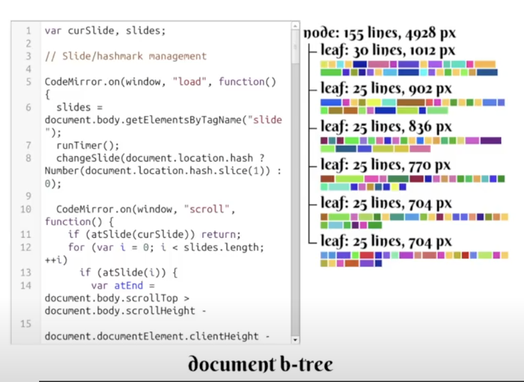

# In Browser Code Editing • Marijn Haverbeke • GOTO 2012

https://www.youtube.com/watch?v=4UlNIb8i9j8&t=2s

好的，这是对 Marijn Haverbeke 关于 CodeMirror 实现细节的演讲的详细讲解。

这个演讲深入探讨了在浏览器中从零开始构建一个功能强大、性能卓越的代码编辑器所面临的挑战和采用的巧妙解决方案。Haverbeke 以他自己的项目 CodeMirror 为例，揭示了为了模拟原生编辑体验而采用的一系列“黑魔法”或“hacks”。

以下是演讲核心内容的逐层分析：

---

### 1. 问题陈述：为什么需要一个自定义代码编辑器？(Intro & HTML)

- **需求 (0:07)**：现代 Web 应用越来越复杂，经常需要在网页中直接编辑代码、模板或查询语言。甚至出现了完整的云端 IDE。
- **HTML 的原生方案：`<textarea>` (0:39)**：
  - **功能极其有限**：Haverbeke 将其比作“记事本（Notepad）”。它的编程接口（API）非常简陋，只能获取/设置值和选区，无法满足语法高亮、智能缩进、代码折叠等高级需求。
  - **性能瓶颈 (1:19)**：对于包含数千行代码的大文件，频繁地获取和设置 `<textarea>` 的 `value` 属性会导致严重的性能问题，使界面卡顿。

---

### 2. 解决方案：模拟一个编辑器 (Project Overview & Slides)

由于原生 `<textarea>` 不可用，唯一的出路就是**完全自己实现一个编辑器**。Haverbeke 介绍了当时（约 2012 年）主流的三个开源项目：

1.  **Ace (2:08)**：源自 Cloud9 IDE，功能全面，开箱即用，属于“大而全”的类型。
2.  **CodeMirror (2:51)**：Haverbeke 自己的项目，最初为他的《Eloquent JavaScript》一书开发。其设计哲学是**轻量、核心最小化、高度可配置**。
3.  **Orion (3:47)**：由 Eclipse 基金会开发，采用了与前两者不同的实现技术（`contentEditable`），演讲最后会提到。

演讲的核心是揭示 CodeMirror v2 和 Ace 所共有的实现技术，即**通过 DOM 元素和 JavaScript 彻底“伪造”一个编辑器**。

---

### 3. 核心“黑魔法”之一：伪造光标和输入 (Cursor)

- **伪造光标 (12:36)**：你在 CodeMirror 中看到的闪烁光标，并不是一个真正的系统光标。它只是一个通过绝对定位（`position: absolute`）放置在文本上方的 `
` 元素，并通过 `setTimeout` 来控制其闪烁，从而在视觉上模仿光标。
- **捕获输入 (13:46)**：为了接收键盘输入并融入浏览器的 Tab 切换（焦点管理）体系，CodeMirror 在后台创建了一个**隐藏的 `<textarea>`**。
  - **如何隐藏 (14:51)**：不能使用 `display: none` 或 `visibility: hidden`，因为那样浏览器会拒绝聚焦它。诀窍是将其放在一个 `overflow: hidden` 的 `
` 中，并把这个 `
` 的尺寸设为零。这样它在视觉上不可见，但浏览器依然认为它可以被聚焦。
  - **好处 (15:14)**：
    1.  **局部事件捕获**：键盘事件可以在这个 `<textarea>` 上被局部捕获，而不是在全局 `window` 上，避免了干扰页面其他部分。
    2.  **处理复杂输入 (15:50)**：对于输入法（IME，如中文、日文输入）或粘贴操作，我们无需解析复杂的按键事件，只需等待最终的文本出现在这个隐藏的 `<textarea>` 中，然后读取它并更新到我们自己的文档模型里。
    3.  **处理剪切/复制 (16:36)**：在 `cut` 或 `copy` 事件触发时（这发生在实际操作之前），CodeMirror 会迅速将当前编辑器的选中文本填入这个隐藏的 `<textarea>` 并选中它，这样系统剪贴板操作就能正确获取到内容。

---

### 4. 核心“黑魔法”之二：处理交互和菜单 (Context Menu)

- **右键菜单 (18:08)**：当你在编辑器上右键时，浏览器只会认为你在一个普通的 `
` 上点击。为了弹出带有“剪切/复制/粘贴/全选”等选项的原生文本编辑菜单，CodeMirror 再次利用了那个隐藏的 `<textarea>`。
  - **骇人听闻的技巧 (18:40)**：在 `contextmenu` 事件触发时（这发生在菜单弹出之前），CodeMirror 会：
    1.  将隐藏的 `<textarea>` 变得几乎透明。
    2.  将其尺寸变得很小。
    3.  **瞬间将它移动到鼠标光标的正下方！**
  - **结果**：浏览器弹出菜单时，会认为你是在这个 `<textarea>` 上右键的，因此会显示正确的文本编辑菜单。操作完成后，`<textarea>` 会被立即移走。这个过程快到用户几乎无法察- 觉。

---

### 5. 核心“黑魔法”之三：处理大文件和滚动 (Scrolling & Big files)

- **虚拟滚动 (19:43)**：为了支持数万甚至数十万行的大文件而不崩溃，编辑器不能将所有内容都渲染到 DOM 中。
  - **原理 (20:02)**：DOM 中只渲染当前**视口（viewport）内可见的部分**以及上下少量边缘区域。
  - **伪造滚动条 (20:22)**：通过放置一个巨大但不可见的 `
` 来撑开滚动区域，使得浏览器的滚动条能够正确反映整个文档的长度。当用户滚动时，监听 `scroll` 事件，然后重新计算并渲染当前可见区域的内容。
- **解决滚动闪烁 (21:05)**：快速滚动时，`scroll` 事件的触发晚于屏幕的实际滚动，会导致用户先看到短暂的空白，然后内容才“闪现”出来。
  - **又一个谎言**：CodeMirror 在真实的滚动条之上，又覆盖了一个**假的滚动条**（也是一个 `
`）。用户拖动的其实是这个假的滚动条。当事件触发时，CodeMirror 有时间先完成内容的重绘，然后再去同步更新真实滚动容器的 `scrollTop` 位置，从而消除了闪烁。
  - **应对透明滚动条 (21:47)**：当 macOS 引入透明滚动条后，这个“覆盖”的技巧失效了（你会同时看到两个滚动条）。于是诞生了更复杂的 hack：将真实的滚动容器做得比编辑器可视区域更宽，然后用 `overflow: hidden` 把多出来的、带有真实滚动条的部分裁掉，从而再次隐藏了它。

---

### 6. 核心数据结构：B-Tree (26:38)

为了高效地管理文档数据，尤其是在固定高度的行失效后（由于自动换行、代码折叠、内联小部件等），CodeMirror 需要一个能快速在**行号、屏幕垂直位置和行对象**之间转换的数据结构。

- **选择 (26:52)**：最终选择了一种在数据库和文件系统中常用的数据结构——**B-Tree**。
- **为什么是 B-Tree (27:05)**：
  1.  **高扇出（宽节点）**：每个节点可以有很多子节点，使得树的高度非常浅。即使是几十万行的文档，树的深度也只有 4-5 层，查询速度极快。
  2.  **批量更新友好**：与红黑树等需要单点插入和复杂平衡的树不同，B-Tree 的平衡算法（分裂和合并）非常简单，对粘贴大量行这样的批量操作非常高效。
  3.  **多维度索引 (30:24)**：由于行高和行数都是单调递增的，可以用同一棵 B-Tree 同时按**行数**和**总高度**进行索引，极大地提高了查找效率。

---

### 7. 语言支持和增量解析 (Modes & Code Analysis)

- **Modes (32:57)**：CodeMirror 通过称为 "mode" 的小 JavaScript 程序来支持不同语言。每个 mode 本质上是一个**可维护状态的词法分析器（tokenizer）**。
- **增量解析 (35:48)**：当用户修改文件时，编辑器无需从头解析整个文档。
  - **状态保存**：编辑器会在文档的各处（例如每隔几十或几百行）保存解析器在那个点的**状态快照**。
  - **局部更新**：当某一行被修改时，编辑器会找到离它最近的**上一个**状态快照，从那里开始重新解析，直到覆盖当前视口。这使得高亮更新的成本被限制在一个很小的范围内。
- **高级功能 (39:07)**：由于 mode 是一个真正的程序，它可以实现非常智能的分析。
  - **XML/HTML 标签匹配**：通过在状态中跟踪标签栈，可以检测到不匹配的闭合标签。
  - **JavaScript 作用域分析 (40:00)**：可以区分局部变量和全局变量，并给予不同高亮。这甚至可以用于实现简单的上下文感知自动补全。
  - **混合模式 (41:25)**：可以轻松组合多个 mode，例如在一个 HTML 文件中，遇到 `<style>` 标签时切换到 CSS mode，遇到 `<script>` 标签时切换到 JavaScript mode。

### 总结

这次演讲是一场关于前端工程极限挑战的精彩展示。它揭示了为了在浏览器这个受限的环境中创造出流畅、强大的用户体验，开发者需要如何打破常规，用一系列看似“丑陋”但极其聪明的“谎言”和“黑魔法”来欺骗浏览器，最终构建出一个令人信服的、高性能的复杂组件。
