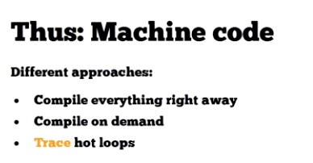

# Marijn Haverbeke: JavaScript Compilation Techniques or "Wasn't JavaScript supposed to be slow?"

https://www.youtube.com/watch?v=rjo5IjJyORI&t=4s

好的，我们来详细讲解 Marijn Haverbeke 关于 “JavaScript 编译技术” 或 “JavaScript 不是应该很慢吗？” 这个主题。

这个演讲的核心在于揭示一个普遍的误解：许多人仍然认为 JavaScript 是一门“解释型”语言，因此天生就慢。Marijn Haverbeke 通过深入浅出的方式，剖析了现代 JavaScript 引擎（如 V8、SpiderMonkey）内部极其复杂的**编译和优化机制**，阐明了为什么今天的 JavaScript 能够达到接近原生代码的执行速度。

以下是这个主题的详细分解：

---

### 1. 问题的提出：“JavaScript 不是应该很慢吗？”

这个标题本身就是一个反问，旨在挑战陈旧观念。

- **过去（1990s - 2000s 中期）**：是的，它确实很慢。早期的 JavaScript 引擎是纯粹的**解释器 (Interpreter)**。

  - **工作方式**：逐行读取源代码，解析一行，执行一行。如果一个函数被调用 1000 次，引擎就会把这个函数的源代码重复解析和理解 1000 次。
  - **缺点**：启动快，但执行效率极低，没有任何优化可言。这导致了 JavaScript “慢”和“玩具语言”的坏名声。

- **现在**：完全不是。现代 JavaScript 引擎是一个高度优化的**即时编译器 (Just-In-Time Compiler, JIT)** 系统。它在运行时将 JavaScript 代码编译成本地机器码。

---

### 2. 核心揭秘：JIT 编译的多层体系

现代 JS 引擎的工作流程不是简单的“解释”或“编译”，而是一个动态的、分阶段的优化过程。它试图在“快速启动”和“快速执行”之间找到最佳平衡。

#### 阶段一：解析与基线执行 (Parsing & Baseline Execution)

1.  **解析 (Parsing)**：当引擎拿到 JS 代码时，它首先会将其解析成一种中间表现形式，通常是**抽象语法树 (AST)**，然后再转换成更利于执行的**字节码 (Bytecode)**。这一步相对较快。

2.  **解释器/基线编译器 (Interpreter/Baseline Compiler)**：
    - 引擎不会等待将所有代码都编译完再执行。为了让应用尽快启动，它会先用一个**解释器**或者一个非常快的**基线编译器**来执行这些字节码。
    - **目标**：尽快开始执行代码。
    - **副作用（关键！）**：在执行的同时，引擎会悄悄地“监视”代码的运行情况，收集**分析数据 (Profiling Data)**。比如：
      - 哪个函数被频繁调用？（这些函数被称为 **“热点函数” - Hot Functions**）
      - 在这些函数中，变量通常是什么类型？（例如，`function add(a, b)` 里的 `a` 和 `b` 是不是总是数字？）

#### 阶段二：优化编译 (Optimizing Compilation)

1.  **识别热点**：当分析器发现某个函数（或循环）变得非常“热”（被执行了成百上千次）时，它会把这个函数标记为值得优化的对象。

2.  **乐观的推测性优化 (Optimistic Speculative Optimization)**：

    - 优化编译器会接管这个“热点函数”。它会根据之前收集到的分析数据，做出一个**大胆的假设**。例如：“`add(a, b)` 这个函数里的参数 `a` 和 `b` **总是**整数。”
    - 基于这个假设，编译器会生成一个高度优化的、专门处理整数加法的本地机器码版本。这个版本省去了所有动态语言需要的类型检查，因此速度极快。

3.  **隐藏类/形状 (Hidden Classes / Shapes)**：这是 JIT 能够进行类型推测的关键技术。引擎会为具有相同结构的对象（相同的属性名和顺序）创建一个内部的“形状”。
    - 例如，`{x: 1, y: 2}` 和 `{x: 10, y: 20}` 共享同一个形状。
    - 当代码访问 `obj.x` 时，如果 `obj` 的形状是已知的，引擎可以直接通过内存偏移量快速访问 `x` 的值，就像在 C++ 或 Java 中一样，而无需进行慢速的属性名查找。
    - 只要对象的形状保持不变，代码就能在优化路径上飞速运行。

#### 阶段三：去优化/回退 (Deoptimization / Bailout)

这是 JIT 机制鲁棒性的保证。

1.  **假设失败**：世界并非总是如预期的那样美好。如果在某个时刻，之前那个被优化为只处理整数的 `add` 函数，突然被这样调用了：`add(10, "hello")`。

2.  **触发回退**：优化后的机器码中包含了一个“守卫”检查。当它发现传入的参数不再是整数时，这个假设就被打破了。

3.  **执行去优化**：引擎会立即抛弃掉那段高度优化的机器码，并回退到之前那个较慢但通用的**基线版本**（解释器或基线编译器版本）来执行这次调用。这个过程称为**去优化 (Deoptimization)** 或 **Bailout**。

4.  **重新优化**：如果这个函数之后又以一种新的、稳定的方式被频繁调用（比如总是两个字符串相加），引擎可能会根据新的分析数据，再次尝试进行一次新的优化编译。

---

### 总结：为什么 JavaScript 不再慢？

Marijn Haverbeke 的讲解归结为以下几点：

1.  **混合模型**：现代 JS 引擎是解释器和多个编译器的混合体，兼顾了启动速度和峰值性能。
2.  **运行时分析**：引擎在运行时持续监控代码，找出性能瓶颈（热点代码）。
3.  **推测性优化**：基于分析数据，大胆地对代码进行类型和结构的假设，并生成极快的机器码。这就像为动态的 JS 代码创建了静态类型的“快速通道”。
4.  **优雅地失败 (去优化)**：当假设被证明是错误的时候，系统有能力安全、无缝地回退到慢速但通用的模式，保证了代码的正确性。

最终，一个典型的、运行时间较长的 JavaScript 应用，其大部分时间（95%以上）都在执行由优化编译器生成的、速度接近原生的机器码。这就是“JavaScript 不是应该很慢吗？”这个问题的答案。它通过一个复杂而智能的动态编译系统，克服了其作为动态语言的天然性能障碍。

---

好的，这是对 Marijn Haverbeke 关于 JavaScript 编译技术的演讲（"Wasn't JavaScript supposed to be slow?"）的详细讲解。

这个演讲深入探讨了现代 JavaScript 引擎（如 V8、SpiderMonkey）如何通过一系列复杂的编译和优化技术，将原本被认为是“慢速解释型语言”的 JavaScript，转变为性能接近原生代码的高性能语言。

以下是演讲核心内容的逐层分析：

---

### 1. 引言与历史背景 (Intro & Perspective)

- **核心观点 (0:32)**：现代 JS 引擎非常智能，开发者通常无需刻意编写“高性能代码”，只要不“做蠢事”（比如故意破坏优化），就能获得很快的执行速度。演讲的重点是揭示引擎内部的“魔法”。
- **性能的飞跃 (1:37)**：演讲通过一个图表展示了过去 15 年 JS 性能的惊人提升（约 100 倍）。从 Netscape 4 和 IE6 的“黑暗时代”，到 Ajax 兴起推动性能竞争，再到现代浏览器（Chrome, Firefox, Safari）都达到了极高的性能水平。
- **基准测试的问题 (3:21, 4:45)**：Marijn 指出，这种性能竞赛部分是由于浏览器厂商针对特定基准测试（如 SunSpider）进行“微优化”。例如，缓存 `Math.cos` 的结果或进行仅在 SunSpider 中有效的死代码消除。这些优化在通用场景下可能没有意义，甚至有害。

---

### 2. 四大核心优化技术 (Outline of the Talk)

Marijn 在 (4:10) 处概述了实现高性能的四个关键领域，这也是演讲的主体结构：

1.  **编译到机器码 (Compilation to Machine Code)**
2.  **高效的值表示 (Value Representation)**
3.  **属性访问缓存 (Inline Caching)**
4.  **垃圾回收 (Garbage Collection)**

---

### 3. 技术详解

#### 3.1. 编译技术 (Compilation)

这是从“解释”到“编译”的演进过程。

- **第一阶段：解释执行 (5:35)**：最古老的方式。解析代码生成语法树 (AST)，然后一个解释器“遍历”这棵树来执行。每次执行都涉及变量名查找等慢速操作，效率极低。
- **第二阶段：字节码编译 (6:20)**：一个进步。将源代码编译成一种中间语言——字节码 (Bytecode)。这步在编译时就解析了变量引用（例如，从变量名 `x` 变为栈上的第 N 个位置），消除了运行时的查找开销。但执行仍需一个字节码解释器。
- **第三阶段：即时编译 (JIT) 到机器码 (7:28)**：现代引擎的核心。
  - **基本 JIT**：在运行时将 JS 代码直接编译成 CPU 可以直接执行的本地机器码，消除了所有解释开销。
  - **自适应优化 (Adaptive Optimization)**：Firefox 的一个精妙策略。引擎首先用快速的解释器运行字节码，同时**监视 (Profile)** 代码。当它发现某个函数或循环被频繁执行（称为**“热点” - Hot Spot**），它会启动一个**优化编译器**。这个编译器利用监视收集到的类型信息（例如，`add(a, b)` 函数中的 `a` 和 `b` 总是数字），生成一个高度优化的、针对特定类型的机器码版本。这个过程也叫**追踪编译 (Trace Compilation)**。

#### 3.2. 静态作用域：编译优化的基石 (Static Scope)

- **为什么 JS 可以被高效编译 (8:28)**：因为 JavaScript 主要是**静态作用域**的。编译器在编译时就能确定一个变量是全局变量、函数参数还是局部变量，并为其分配好存储位置（如寄存器或内存地址）。
- **性能杀手：`with` 和 `eval` (9:20, 9:59)**：
  - `with` 语句会引入一个**动态作用域**，使得编译器无法在编译时确定变量的来源，每次访问变量都必须进行慢速的运行时查找。结论：**不要使用 `with`**。
  - `eval` 同样能动态改变作用域。但这里有一个关键区别：
    - **本地 `eval` (Local eval)**：直接调用 `eval('...')`。它会影响当前函数的局部作用域，破坏编译优化。
    - **间接/全局 `eval` (Indirect/Global eval)**：通过其他方式调用，如 `(0, eval)('...')` 或将 `eval` 赋值给另一个变量再调用。这种 `eval` 在全局作用域中执行，不会污染局部作用域，因此对性能的影响小得多。结论：**需要动态执行代码时，优先使用间接 `eval`**。

#### 3.3. 值表示法 (Value Representation)

在动态语言中，每个值都必须携带其类型信息。如何高效地存储这些“值+类型”是关键。

- **问题 (12:56)**：最朴素的方法是将所有东西（包括数字）都作为对象存储在堆上（称为**“装箱” - Boxing**）。但这对于频繁创建的数字来说，会产生巨大的内存分配和回收开销，是不可接受的。
- **解决方案 1：指针标记 (Pointer Tagging) (13:27)**：利用内存对齐的特性。在 32 位系统中，指针地址通常是 4 的倍数，这意味着其末尾两位总是 `00`。引擎可以利用这些未使用的位来存储类型标记。例如，用 `1` 结尾表示这是一个整数（值直接存在指针本身里），用 `0` 结尾表示这是一个指向堆上对象的指针。这避免了为小整数分配内存。
- **解决方案 2：NaN 装箱 (NaN Boxing) (15:01)**：一个更高级的技巧，尤其在 64 位系统上。
  - IEEE 754 浮点数标准定义了大量的“非数字”(NaN) 值。
  - 引擎利用这些“无效”的 NaN 表示，将类型标记和值（如 32 位整数或指针地址）编码到 64 位的浮点数空间里。
  - **巨大优势**：一个标准的 64 位浮点数、一个整数、一个布尔值或一个对象指针，都可以用一个统一的 64 位字来表示，无需任何装箱。这使得处理数字和对象引用的代码非常统一和高效。

#### 3.4. 垃圾回收 (Garbage Collection - GC)

自动内存管理是 JS 的特性，但如果实现不当，会导致“卡顿”。

- **基本算法：标记-清除 (Mark and Sweep) (18:07)**：从根对象（全局变量等）开始，遍历所有可达的对象并“标记”它们。遍历结束后，所有未被标记的对象都是垃圾，可以被“清除”。问题在于，这个过程通常需要**“停止世界” (Stop the World)**，即暂停所有 JS 执行，导致应用无响应。
- **优化 1：分代 GC (Generational GC) (20:22)**：基于一个重要观察：“大部分对象死得很快”。
  - 将堆分为**“新生代” (Young Generation)** 和**“老生代” (Old Generation)**。
  - 所有新创建的对象都放在新生代。
  - GC 主要频繁地在小的新生代区域进行，这个过程非常快。
  - 只有在多次 GC 后仍然存活的对象，才会被“晋升”到老生代。
  - 对老生代的完全 GC 发生的频率则低得多。这大大减少了“停止世界”的频率和时长。

#### 3.5. 属性访问：内联缓存 (Inline Caching - IC)

这是解释 JS 当前速度的最重要因素之一。

- **问题 (23:22)**：JS 对象的属性是动态的，`obj.x` 的查找过程理论上很复杂（查找自身属性 -> 查找原型链）。
- **解决方案：内联缓存 (Inline Caching) (23:42)**：
  - **隐藏类 (Hidden Classes / Shapes)** (24:45)：引擎在内部为具有相同结构（相同属性、相同添加顺序）的对象创建了一个“隐藏类”。例如，所有通过 `new Point(x, y)` 创建的对象都共享同一个隐藏类。
  - **缓存查找结果**：当代码第一次执行 `point.x` 时，引擎会查找到 `x` 在该隐藏类对象内存布局中的**偏移量 (offset)**。然后，它将 **<隐藏类, 偏移量>** 这个组合缓存起来。
  - **快速路径**：下一次再执行 `point.x` 时，引擎只需检查 `point` 的隐藏类是否与缓存中的匹配。如果匹配，它就可以直接通过偏移量访问属性值，速度和静态语言（如 C++）一样快，完全避免了慢速的属性查找。
- **多态内联缓存 (Polymorphic IC)** (24:26)：IC 不仅能缓存一种隐藏类，还能缓存一个小的列表（例如 4-5 种），使得即使函数处理几种不同“形状”的对象，也能保持高速。
- **结论**：只要你保持对象结构的稳定（例如，不要随意添加/删除属性，始终用相同顺序初始化属性），就能充分利用内联缓存带来的巨大性能提升。

---

### 总结

Marijn Haverbeke 的演讲清晰地阐明了现代 JavaScript 引擎并非简单的解释器，而是一个极其复杂的**自适应动态编译系统**。它通过 JIT 编译、高效的值表示、分代垃圾回收以及至关重要的内联缓存等技术，在运行时将动态的 JS 代码转换成高度优化的本地机器码，从而实现了令人惊叹的性能。

---

- Compilation
  
  
  
  
  
  
  global eval is faster
- Value Representation
  NAN Tagging
  
  
- Garbage Collection
  标记-清除 + 分代 GC
- Inline Caching
  
  
