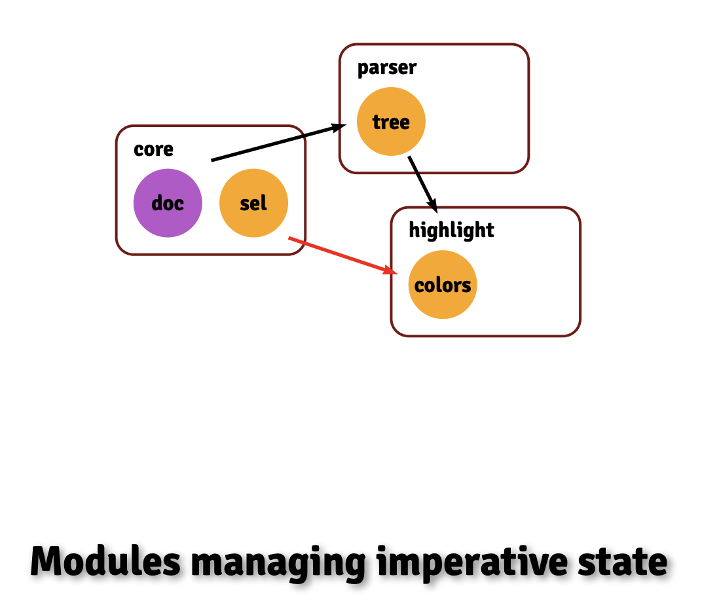
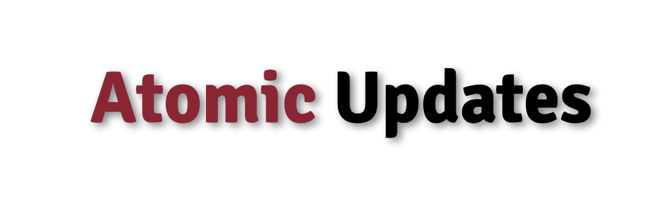
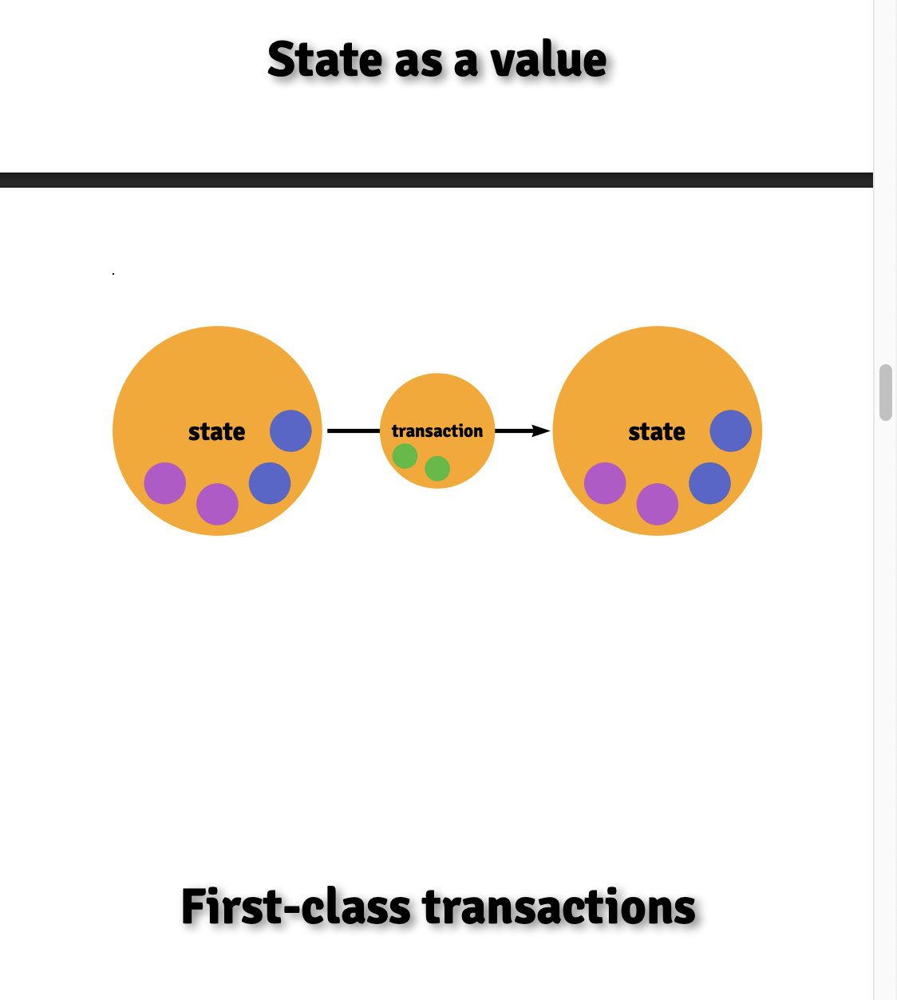
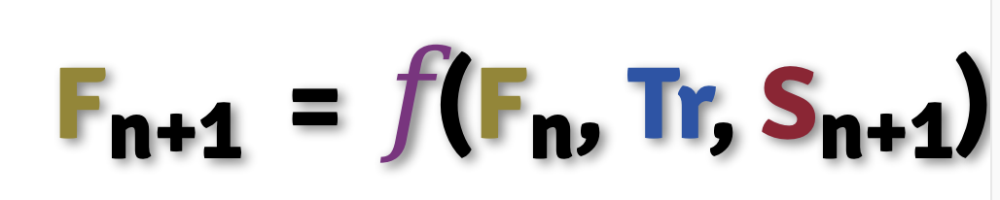
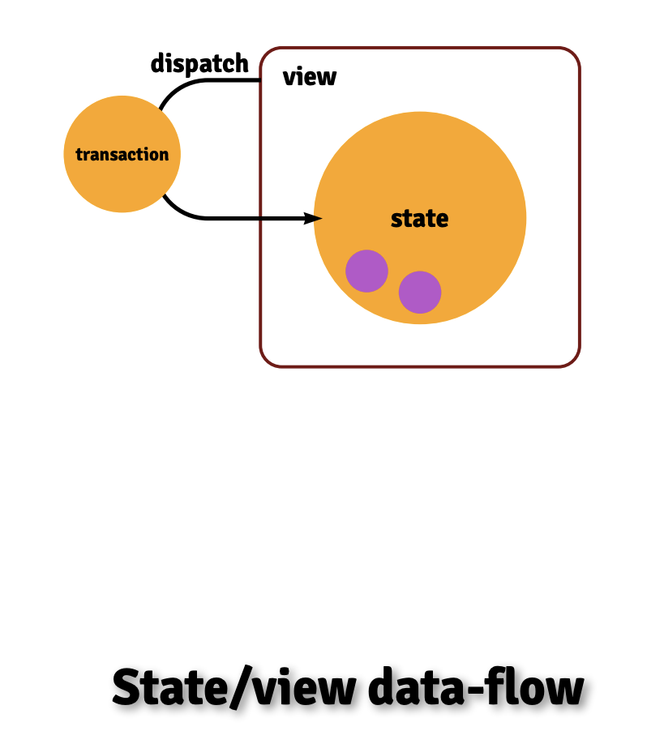
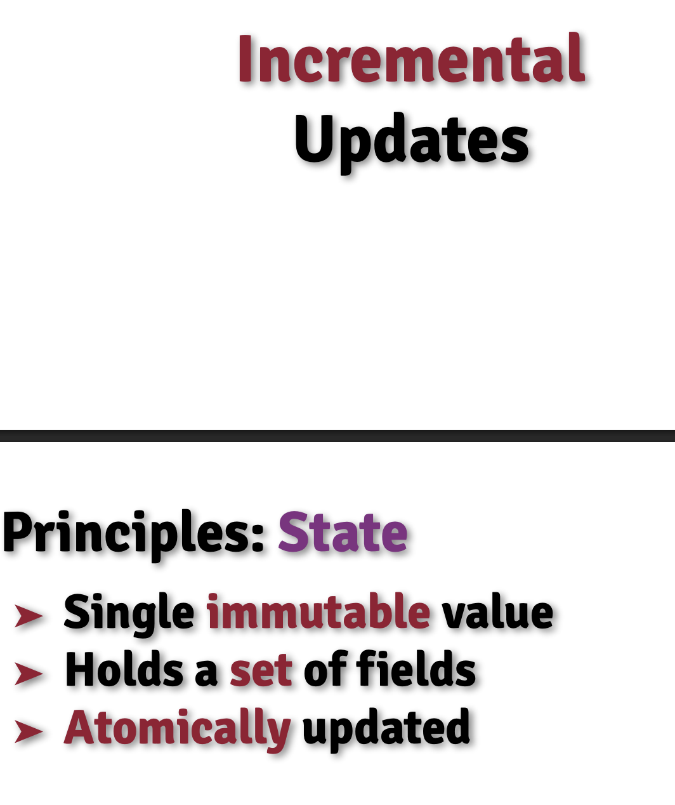
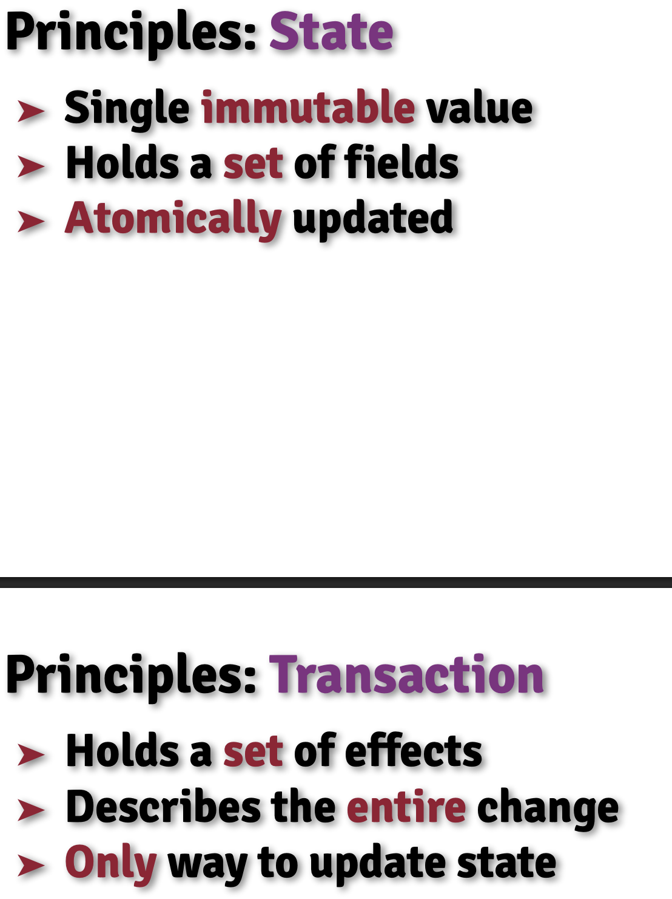

# State transitions in Complex Systems

- 
- 
- 
- 
- 
- 
- 

https://bobkonf.de/2023/slides/haverbeke.pdf

好的，我们来详细讲解这段关于“复杂系统中的状态转换”的文字。

这段文字是 Marijn Haverbeke 为其在 CodeMirror 6 编辑器设计中所采用的架构哲学所做的精彩概述。它精准地指出了现代复杂软件（尤其是可扩展软件）在状态管理方面面临的核心挑战，并提出了一个基于函数式编程思想的优雅解决方案。

我们可以将这段文字分解为三个核心部分来理解：**问题、示例和解决方案**。

---

### 1. 问题：复杂与可扩展系统中的状态一致性

> "In systems whose state consists of a non-trivial number of separate but related pieces, updating this state in a way that keeps everything coherent requires some discipline. In extensible systems, where the different pieces may not even be aware of each other, this becomes even more challenging."

这里定义了问题的两个层面：

- **内在复杂性**：系统状态不是一个单一的值，而是由许多**独立但又相互关联**的部分组成的。例如，一个简单的状态更新（如用户输入一个字符）可能会引发一系列连锁反应，需要同时更新多个相关的状态部分。要保证在任何操作后，所有这些部分都保持逻辑上的一致（coherent），需要一套严谨的规则和约束（discipline）。

- **外在扩展性**：问题变得更棘手的地方在于，系统是**可扩展的**。这意味着第三方开发者可以添加他们自己的状态片段和功能。这些插件彼此之间可能毫不知情，但它们的状态仍然需要与核心状态以及其他插件的状态保持一致。如果缺乏一个强大的架构来协调，整个系统很容易陷入“状态地狱”，出现各种难以预测的 bug。

---

### 2. 示例：模块化代码编辑器

> "A good example of such a system is a modular code editor. It involves a number of constantly-changing pieces of state (the document, selection, scroll position, and so on) and a lot of non-core state intimately entangled with those (syntax highlighting, linting, completion), and possibly with each other."

为了让问题更具体，Haverbeke 用了一个完美的例子——现代代码编辑器（如 VS Code, CodeMirror, ProseMirror）。

- **核心状态 (Core State)**：

  - **文档 (Document)**：编辑器中的文本内容。
  - **选区 (Selection)**：光标位置或用户选择的文本范围。
  - **滚动位置 (Scroll Position)**：视图的滚动条位置。
    这些状态紧密关联：删除文本（改变文档）必须更新光标位置（改变选区）。

- **扩展状态 (Non-core State)**：这些通常由插件提供。
  - **语法高亮 (Syntax Highlighting)**：依赖于文档内容。
  - **代码检查 (Linting)**：依赖于文档内容，并可能需要显示错误标记，这又与滚动位置和选区有关。
  - **自动补全 (Completion)**：依赖于光标位置（选区）和文档内容。

这里的关键是 **“紧密纠缠” (intimately entangled)**。所有这些独立的状态片段，无论是核心的还是扩展的，都像一个巨大的关系网，牵一发而动全身。

---

### 3. 解决方案：CodeMirror 的架构原则

> "This presentation discusses the set of principles we arrived at in designing such an editor (CodeMirror), and compares it to the more traditional event-style architectures. The editor uses persistent state values and first-class transactions, both of them extensible by 3rd-party code, to make it straightforward by construction to keep the zoo of interdependent data involved in a full-featured editor coherent."

这里提出了 CodeMirror 的解决方案，并将其与传统方法进行对比。

#### 传统方法：事件驱动架构 (Event-style Architectures)

在传统模型中，当某件事发生时（如用户输入），系统会发出一个事件（如 `documentChanged`）。各个模块（或插件）监听这些事件，然后各自去更新自己的状态。

- **缺点**：
  - **顺序依赖**：监听器的执行顺序可能很重要，但往往难以控制。
  - **竞态条件**：多个监听器可能试图修改同一个状态，导致冲突。
  - **缺乏中心协调**：没有一个“单一事实来源”来描述整个状态转换。每个模块都只能看到一部分变化，很难保证全局的一致性。

#### CodeMirror 的新方法：持久化状态与一等事务

CodeMirror 采用了一种更可预测、更健壮的函数式方法。

1.  **持久化状态值 (Persistent State Values)**：

    - 状态是**不可变的 (immutable)**。你不能直接修改当前状态。
    - 任何更新都会创建一个**全新的状态值**。这就像 `const newState = oldState + change`。
    - **优点**：由于状态不会在“背后”被意外修改，代码变得极易推理。你可以随时比较新旧状态，精确地知道发生了什么。

2.  **一等事务 (First-class Transactions)**：

    - “事务”是描述一次完整状态更新的对象。它包含了从一个状态到下一个状态的所有**变化描述 (changes)**。
    - 它是**“一等的” (first-class)**，意味着它是一个普通的值，可以被创建、组合、传递和检查，**然后才被应用**。
    - **工作流程**：
      a. 系统创建一个空的事务。
      b. 核心代码和所有插件都可以向这个事务中添加自己的变化描述。例如，用户输入会添加一个文本变更，一个插件可能会添加一个元数据来标记某个区域需要重新 lint。
      c. 所有变化被收集完毕后，系统调用一个函数 `newState = oldState.apply(transaction)`，一次性地、原子地计算出全新的、完全一致的 `newState`。

3.  **可扩展性 (Extensible)**：
    - 这个架构的核心优势在于其可扩展性。第三方插件可以定义自己的状态字段，并将其附加到主状态上。它们也可以定义自己的变化类型，并将其附加到事务中。
    - 整个系统通过这个统一的、中心化的事务流程来协调所有部分的更新，从而**从结构上 (by construction)** 保证了最终状态的一致性。

### 总结

这段文字描述了一种从混乱的、基于事件和副作用的状态管理，转向一个清晰的、可预测的、基于不可变数据和中心化事务的函数式模型的范式转变。通过将**状态 (State)** 和**变化 (Transaction)** 都作为可扩展的一等公民，CodeMirror 架构优雅地解决了在复杂、模块化的系统中保持数据一致性的核心难题。

---

好的，这是对 Marijn Haverbeke 关于“复杂系统中的状态转换”演讲的详细讲解。

这个演讲深入探讨了 CodeMirror 6（一个现代、可扩展的代码编辑器）背后的核心架构理念。Haverbeke 阐述了在构建一个由大量独立但又相互关联的模块（尤其是第三方插件）组成的复杂系统时，如何通过一种函数式的、纪律严明的方法来保证状态的一致性和可预测性。

以下是演讲内容的逐层分析：

---

### 1. 问题定义：可扩展系统中的状态管理挑战 (00:00:05 - 00:03:04)

- **核心挑战**：演讲的核心是解决一个问题：在一个高度可扩展的系统中，大部分功能由**互不知晓**的独立模块（插件）提供，如何管理它们各自的状态，并确保它们在更新时不会相互干扰，始终保持整个系统的一致性？
- **CodeMirror 作为范例**：
  - **极度可扩展 (00:01:02)**：CodeMirror 的设计哲学是拥有一个极小的核心，而像撤销/重做历史、语法高亮等传统意义上的核心功能，都是作为“扩展”实现的。它们使用的 API 与第三方开发者完全相同，这保证了系统的灵活性和可替换性。
  - **状态相互依赖 (00:02:06)**：所有这些扩展都有自己的状态，而这些状态几乎都依赖于核心的“文档”状态。当文档改变时，所有扩展都需要更新自己的状态以保持同步。此外，它们还可能依赖于选区等其他状态，形成一个复杂的依赖网络。
  - **多样的状态转换 (00:02:36)**：更新的来源多种多样，不仅有用户的输入、撤销/重做等基本操作，还有各种扩展引入的自定义操作。

---

### 2. 传统方法的弊端：事件驱动架构 (00:03:09 - 00:05:55)

Haverbeke 首先批判了 JavaScript 世界中常见的、基于事件处理器的传统模型。

- **工作方式**：当某个状态（如文档）改变时，它会发出一个事件。其他模块（如语法高亮器、Linter）监听这个事件，然后在事件处理器中各自更新自己的状态。
- **核心缺陷：可观察到的不一致状态 (Observable Inconsistent State) (00:04:23)**：
  - **更新顺序问题**：事件处理器的执行顺序通常是不可预测或难以控制的。
  - **竞态条件**：Haverbeke 举了一个经典例子 (00:04:43)：文档更新后，`highlighter` 的事件处理器先触发了。它去读取 `parser` 的语法树，但此时 `parser` 的事件处理器还没来得及运行，导致 `highlighter` 拿到了一个**过时的、与新文档不匹配的**语法树，从而产生错误。
  - **难以推理**：整个更新过程像一个不透明的事件网络，当出现问题时，很难追溯和调试。
- **生动的比喻 (00:05:18)**：传统方法就像在一张纸上记录状态，每次更新都用橡皮擦掉旧的，再写上新的。在“擦写”的过程中，这张纸处于一个中间的、不完整的状态。

---

### 3. CodeMirror 的解决方案：函数式、原子化更新 (00:05:55 - 00:09:15)

受 Redux、Elm 等函数式思想的启发，CodeMirror 采用了一套完全不同的架构。

- **原则一：单一、不可变的持久化状态 (00:06:02)**

  - 整个编辑器的所有状态被视为一个**单一的、不可变的 (immutable) 值**。
  - 更新状态不是去修改旧的状态，而是通过计算产生一个**全新的状态值**。
  - **原子化更新 (00:06:14)**：更新过程的最后一步，是原子性地将一个指针从旧状态对象切换到新状态对象。这意味着在任何时刻，系统要么处于完全一致的旧状态，要么处于完全一致的新状态，**绝不会存在中间的不一致状态**。
  - **比喻 (00:05:36)**：这就像每次更新都拿一张**全新的纸**，把所有新的、一致的状态一次性写好，然后直接替换掉旧的那张纸。

- **原则二：可扩展的状态字段 (State Fields) (00:06:32)**

  - 为了支持扩展，这个单一的状态对象不是一个固定的结构。它由一组可动态添加的“字段 (fields)”组成。每个扩展都可以定义自己的状态字段，并提供更新该字段的逻辑。

- **原则三：一等公民的事务 (First-class Transactions) (00:07:06)**
  - 这是解决扩展间通信和协调的关键。
  - **是什么**：一次更新的所有信息被封装在一个叫做“事务 (Transaction)”的对象里。它是一个**一等公民 (first-class)**，意味着它可以被创建、传递和检查。
  - **内容**：一个事务包含一个**效果集合 (set of effects)** (00:08:14)。“效果”是描述状态变化的具体单元。
  - **为什么不用 Actions** (00:07:21)：Haverbeke 特别指出，像 Redux/Elm 中常见的 `Action`（通常是一个联合类型）在可扩展系统中效果不佳，因为扩展无法预知所有可能出现的 Action 类型。
  - **“效果集合”的优势**：任何扩展都可以定义自己的“效果”类型。当一个事务发生时，其他扩展的更新逻辑可以遍历事务中的效果集合，**只挑选自己感兴趣的效果进行响应，而安全地忽略其他所有不认识的效果**。这实现了模块间的完美解耦。

---

### 4. 架构的实现细节与优势 (00:09:15 - 00:21:27)

- **纯函数更新 (00:09:07)**：`newState = f(oldState, transaction)`。这种纯函数关系使得系统行为变得极易推理和测试。你可以轻松地实现状态快照、状态对比等功能。
- **处理字段间的依赖 (00:11:35)**：一个字段的更新可能需要读取另一个字段的**新值**。这看似会产生循环依赖。CodeMirror 通过一个“戏法 (sleight of hand)”解决：
  1.  字段的更新函数会接收到**正在被创建的 `newState` 对象**作为参数。
  2.  当一个字段的更新逻辑试图访问另一个尚未计算的字段时，系统会**立即、递归地**先去计算那个被依赖的字段。
  3.  通过追踪字段的“未初始化/正在初始化/已初始化”状态，系统可以自动按需以拓扑排序的方式计算所有字段，并能检测出真正的循环依赖并报错。
- **动态重配置 (00:13:52)**：用户可以在运行时启用或禁用一个扩展。这也是通过一个特殊的事务来完成的。系统会计算出新的状态“形状”，保留那些仍然存在的字段的值，丢弃被移除的，并初始化新添加的。
- **与命令式的世界交互 (00:16:17)**：编辑器视图 (`EditorView`) 是一个命令式的 UI 组件。它的工作流程是：
  1.  `View` 监听用户的 DOM 事件（如键盘输入）。
  2.  将事件转换为一个 `Transaction` 并“派发 (dispatch)”它。
  3.  系统根据 `oldState` 和 `transaction` 计算出 `newState`。
  4.  `View` 接收到 `newState` 和 `transaction`，然后执行**增量更新**，只修改 DOM 中真正发生变化的部分，从而实现高性能。
- **增量计算 (00:17:16)**：由于 `Transaction` 精确地描述了所有变化，各种派生数据（如语法树、Linter 警告的位置）的计算都可以是增量的，而不是每次都从头开始，这对于保持编辑器响应速度至关重要。

---

### 5. 实际应用示例 (00:21:27 - 00:28:40)

Haverbeke 通过几个例子展示了这个架构的威力：

- **撤销历史 (Undo History) (00:21:33)**：

  - 它是一个扩展，监听所有包含“文档变更”效果的事务。
  - 它计算出变更的“逆操作”并存储在自己的状态字段（一个栈）中。
  - 当用户按下撤销键，它会派发一个新事务，该事务包含栈顶的逆操作，并附带一个特殊效果，告诉自己“从栈中弹出一个事件”。

- **代码检查 (Linter) (00:23:41)**：

  - Linter 扩展通常包含一个命令式的部分，在后台异步运行。
  - 当检查完成后，它派发一个事务，其中包含一个“添加 Linter 错误”的效果。
  - 其他部分的状态（如错误标记的位置）会随着文档的后续编辑，通过“位置映射 (mapping positions)”逻辑自动更新，直到下一次 Linter 重新运行。

- **协同编辑 (Collaborative Editing) (00:26:09)**：
  - 这也是一个扩展，它通过状态字段追踪本地尚未发送到服务器的变更。
  - 当接收到来自其他人的远程变更时，它使用操作转换 (Operational Transformation, OT) 的算法，将本地变更“变基 (rebase)”到远程变更之后，从而解决冲突。
  - Haverbeke 特别提到，由于架构的灵活性，社区也实现了基于 CRDT (Y.js) 的协同编辑插件，证明了核心系统与具体实现是解耦的。

### 总结

这次演讲的核心思想是，通过拥抱**不可变性、单一状态树和中心化的、可扩展的事务**，可以构建一个在结构上就保证了一致性的复杂系统。这种函数式方法虽然在命令式的 JavaScript 环境中有一定的成本，但它带来的**可预测性、可测试性和健壮性**，尤其是在一个充满未知第三方扩展的环境中，是传统事件驱动模型无法比拟的。
