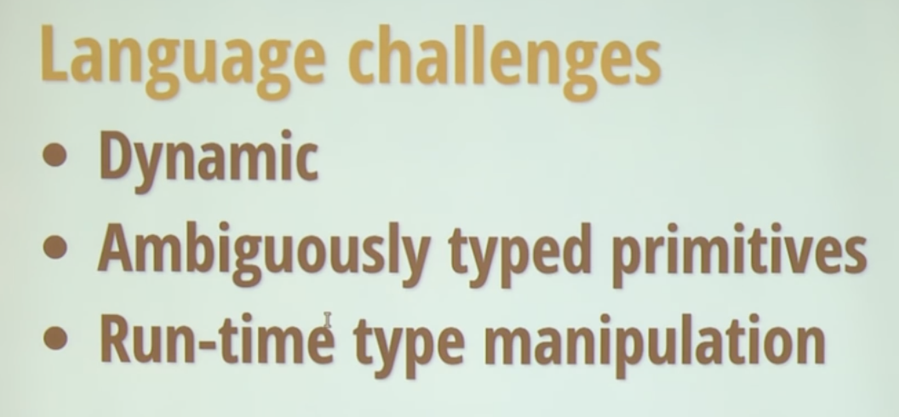
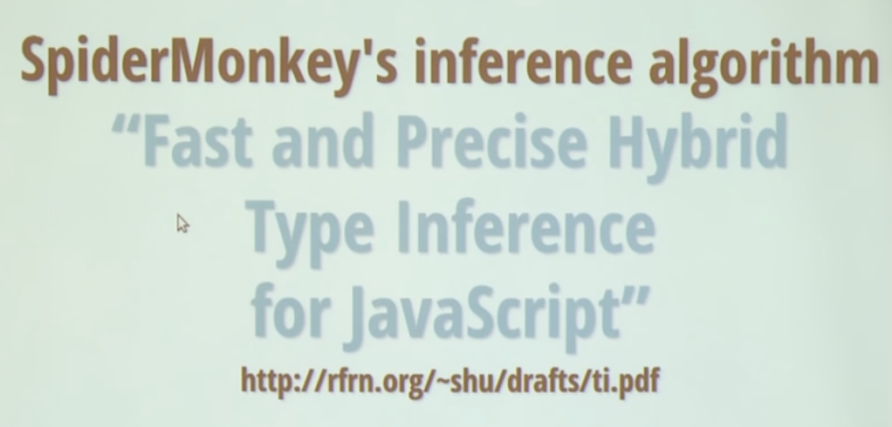
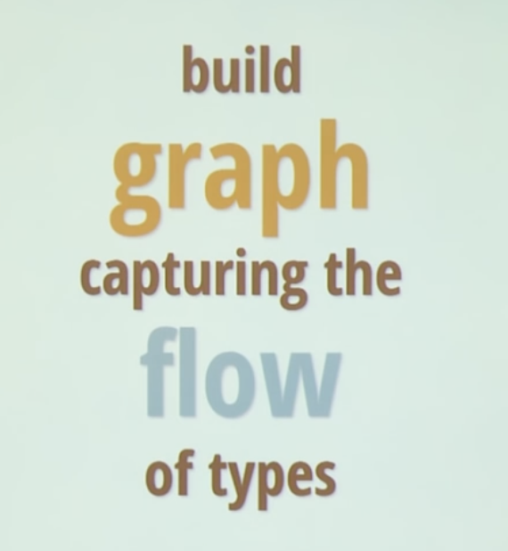

# Marijn Haverbeke - Tern: Practycal Type Interference for Java Script Editing - Curry On

https://www.youtube.com/watch?v=wW5VbogkDQ4

好的，这是对 Marijn Haverbeke 关于 Tern 项目的演讲的详细、深入的分析讲解。

这个演讲的核心是介绍 Tern，一个专门为 JavaScript 设计的静态分析器。Haverbeke 详细阐述了 Tern 的设计目标、核心算法、面临的挑战以及它与其他类似工具（如类型检查器、linter）的根本区别。

---

### 1. 引言与目标：Tern 是什么？(Intro & Tern Demo)

- **核心定义 (0:06)**：Tern 是一个**静态分析器**，其**唯一且明确**的目标是**改善编辑器的辅助功能和集成**（improving editor assistance and integration）。
- **它不是什么 (0:19)**：
  - 它**不是**一个类型检查器（Type Checker），如 TypeScript 或 Flow。它的目标不是保证程序的类型安全。
  - 它**不是**一个代码风格检查器（Linter）。
- **它的核心任务 (0:24)**：**类型推断（Type Inference）**。但这种推断是服务于编辑器辅助的，因此其设计哲学与传统的类型检查器截然不同。
- **功能演示 (0:44)**：
  - **上下文感知自动补全**：知道 `window` 对象上有哪些属性。
  - **文档提示**：显示函数或属性的文档。
  - **基本重构**：如变量重命名，能正确处理作用域。
- **灵感来源 (1:51)**：来自 Lisp 和 Clojure 的开发环境（如 Emacs SLIME）。这些环境通过与一个**正在运行的程序实例（running image）** 通信来获取精确的类型信息和上下文。因为 JavaScript 实现没有这种机制，所以需要一种新的方法。
- **Tern 的架构 (2:47)**：Tern 是一个**与编辑器并行的独立进程**。它会“吞下”你项目中的所有代码，进行分析，并构建一个内部模型。编辑器通过一个简单的 HTTP 协议向 Tern 服务发送查询请求，以获取补全、定义跳转等信息。

---

### 2. 核心挑战：为什么给动态语言做静态分析这么难？(Why Integration for Dynamic Languages)

Haverbeke 指出，JavaScript 似乎竭尽全力让静态分析变得困难：

1.  **动态类型 (3:29)**：无法仅从源代码通过形式化算法推导出变量的精确类型。
2.  **模糊的类型语义 (3:34)**：JavaScript 的操作符（如 `+`）和内置函数会进行大量的隐式类型转换。`a + 1` 并不意味着 `a` 一定是数字。因此，不能从“使用方式”反向推断类型，必须从“值的来源”正向推断。
3.  **运行时类型操纵 (4:18)**：可以在运行时任意修改对象和原型，这是静态分析的噩梦。
4.  **`eval` 和 `with` (4:40)**：这些特性可以执行任意字符串作为代码，甚至动态改变作用域链，使得可靠的分析几乎不可能。

- **Tern 的设计抉择：放弃健全性 (Soundness) (4:55)**
  - **健全性 (Soundness)**：指分析器保证如果它说程序没有类型错误，那么程序在运行时就绝不会出现类型错误。追求健全性通常需要对语言进行限制（如定义一个安全的子集），并且分析成本极高。
  - **Tern 的目标**：**在面对“正常”代码时尽可能提供帮助，在面对“奇怪”代码时尽力而为**。它不担心偶尔出错，因为它不是为了保证程序正确性，而是为了提升开发效率。这种妥协使得分析可以更廉价、更快速、更简单。

---

### 3. 核心算法：抽象释义与数据流图 (Abstract Interpretation & Graph)

Tern 的核心是一种称为**抽象释义（Abstract Interpretation）** 的技术，结合了数据流分析的思想。

- **工作流程 (10:53)**：Tern 遍历整个代码库的抽象语法树（AST），并构建一个**图（Graph）**。这个图表示了**类型在程序中的流动方式**。
- **图的构成**：
  - **节点 (Nodes) - 抽象值 (Abstract Values) (11:15)**：图中的橙色节点代表“抽象值”。每个抽象值对应程序中的一个“位置”（如一个变量、一个对象属性），这个位置可能包含一种或多种类型。
  - **边 (Edges) - 类型流 (11:41)**：图中的边代表类型流动的路径。例如，`y = x` 会在 `x` 的抽象值和 `y` 的抽象值之间创建一条边，表示所有流入 `x` 的类型也会流入 `y`。
- **示例分析 (13:29 - 19:10)**：

  1.  `var x = "hello"`：一个 `string` 类型流入了 `x` 的抽象值。
  2.  `var y = x`：在 `x` 和 `y` 之间创建了一条边，`string` 类型通过这条边流向了 `y`。
  3.  `y = true`：一个 `boolean` 类型也流入了 `y`。由于 Tern **忽略了控制流**（为了简化和性能），它会认为 `y` 的类型是 `string | boolean` 的联合类型。
  4.  **函数调用**：当分析一个函数调用时（如 `r = f("a", "b")`），Tern 会创建一个复杂的子图：
      - 为函数 `f`、返回值 `r`、每个参数和调用本身创建抽象值。
      - 创建一个紫色的**活动节点（Active Node）** 来代表这次调用。
      - 当 `f` 的函数类型被推断出来后，这个类型会流入活动节点。
      - 活动节点会将**调用的参数**与**函数的形参**连接起来，将**函数的返回类型**与**调用的结果**连接起来。
      - 这样，当实际的参数类型（如 `string`）流入函数时，它们会通过函数体内的逻辑（如 `+` 操作），最终计算出返回类型，并流回到 `r`。

- **关键特性：顺序无关 (Order Independence) (15:44)**：Tern 的分析是顺序无关的。无论你以何种顺序加载文件和定义，最终推断出的结果都是一样的。这对于处理模块依赖和异步加载至关重要。

---

### 4. 处理复杂情况的技巧

简单的类型流动图对于处理现代 JavaScript 中的复杂模式是远远不够的。Tern 采用了一些高级技巧来应对。

- **处理多态/泛型 (Polymorphism) (30:20)**

  - **问题**：对于像 `last(array)` 这样的泛型函数，如果简单地将所有调用中的数组元素类型合并，返回类型会变成一个无用的大联合类型（`number | string | ...`）。
  - **解决方案 (31:05)**：在分析函数体时，Tern 会进行一次浅层的图搜索，尝试找到从**参数**到**返回值**的路径。如果找到了这样的路径（例如，返回值直接来自数组的某个元素），它会为这个函数生成一个特殊的**计算函数**。在每次调用时，Tern 不再使用标准的类型流，而是直接调用这个计算函数，根据传入的参数类型来动态计算返回类型。这在效果上模拟了泛型。

- **处理运行时类型操纵 (Type Manipulation) (33:06)**

  - **问题**：像 `extend(dest, src)` 这样通过循环复制属性来构建对象的辅助函数，会使标准的类型流分析完全失效。
  - **解决方案 (33:26)**：
    1.  **启发式检测**：Tern 会使用一些启发式规则来判断一个函数是否是“类型操纵函数”。
    2.  **切换到昂贵模式**：如果一个函数被认为是类型操纵函数，它会进入一种特殊模式。在这种模式下，**每一次对该函数的调用，都会重新实例化（re-instantiated）其内部的分析子图**。
    3.  **效果**：这相当于为每次调用创建了一个独立的上下文，使得属性复制等操作可以被精确追踪。这非常昂贵，且容易在递归中导致无限循环，但对于处理常见的库（如 Underscore.js）和类继承模式至关重要。

- **利用图上下文进行猜测 (Graph Context) (37:11)**
  - **问题**：当无法推断出一个值的类型时（例如，在一个库文件中，函数从未被调用），自动补全会失效。
  - **解决方案**：Tern 会反向利用图。例如，当需要补全 `obj. ` 时，如果 `obj` 类型未知，Tern 会查看从 `obj` **流出**的边。如果发现 `obj` 的值被用于调用 `.foo()` 和 `.bar()`，Tern 会在已知的类型库中搜索哪些对象同时拥有 `foo` 和 `bar` 方法，并基于这个猜测提供补全。

---

### 5. 与其他工具的对比

- **Visual Studio (40:16)**：VS 的早期方法非常不同。它内置了一个**被插桩（instrumented）的 JavaScript 引擎**，它会**实际运行**代码（在禁用了 I/O 的沙箱环境中），然后观察运行时产生的对象和类型。

  - **优点**：能完美处理动态类型操纵。
  - **缺点**：无法分析从未被执行到的代码路径。
  - Haverbeke 认为，理想的系统可能是两者的结合：先进行一次解释执行，然后用执行结果作为静态分析的输入。

- **Flow 和 TypeScript (43:03)**：这些是真正的类型检查器。它们拥有更强大、更形式化的类型系统，并依赖于**类型注解**。
  - **优点**：能提供更准确、更可靠的类型信息。
  - **缺点**：需要开发者学习新的语法并在代码中添加注解，改变了开发流程。

### 总结

Tern 是一个在实用主义哲学指导下设计的杰出工具。它深刻理解了为编辑器提供辅助这一特定目标，并为此做出了关键的设计妥协——**放弃健全性以换取速度、简易性和对真实世界“混乱”代码的适应性**。通过创新的抽象释义图、顺序无关的分析以及针对多态和元编程的特殊处理技巧，Tern 在不侵入代码、不改变开发范式的前提下，为动态的 JavaScript 语言提供了令人惊讶的、足够“好用”的静态分析能力。
