# Marijn Haverbeke - Grammar-based language modes for text editors

https://www.youtube.com/watch?v=1qIee0aHOhY

- 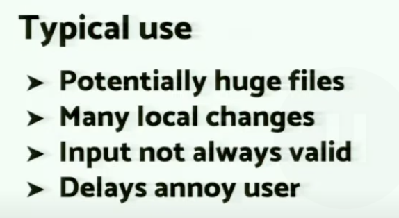
- 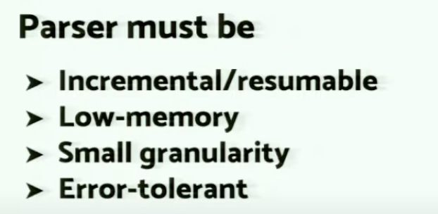
  增量解析搭配虚拟渲染、协同编辑
- 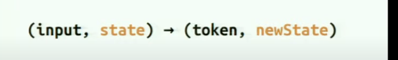
- 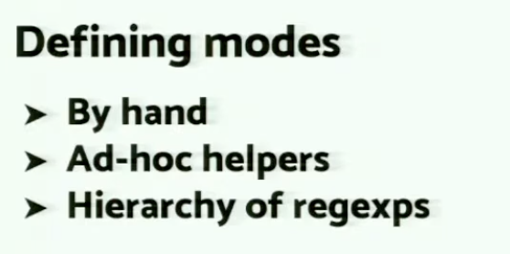
- 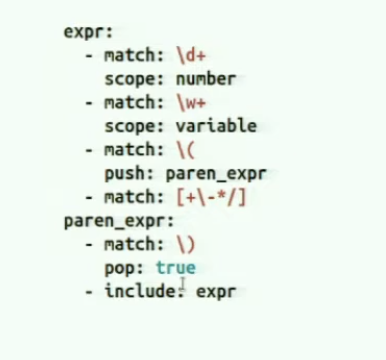
- 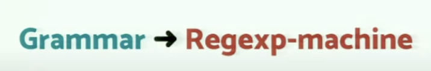
- 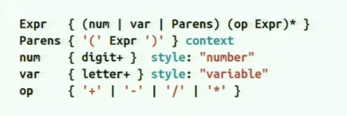
- 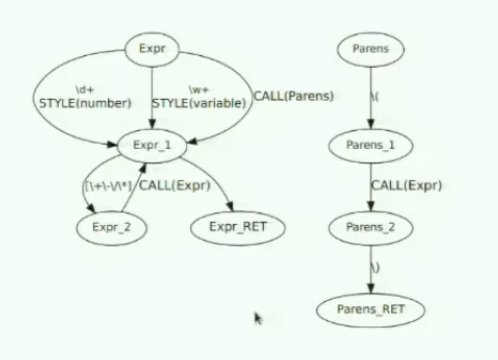
- 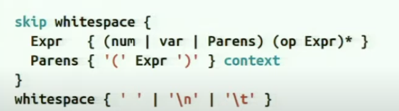
- 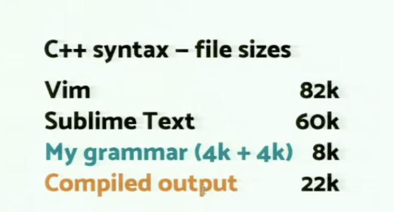
- 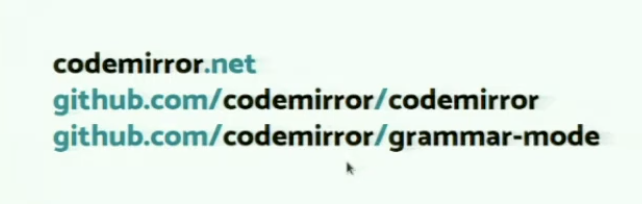

这篇摘要的核心思想是：**使用解析器表达语法（Parser Expression Grammars, PEG）来替代传统的、基于正则表达式的方法，以实现更强大、更精确、更易于维护的代码编辑器语言功能（如语法高亮、智能缩进、结构化编辑等）。**

下面是对摘要中各个要点的详细讲解：

### 1. 传统方法的局限性

- **问题描述**: 为了让编辑器“理解”代码，我们需要为其提供语言知识，最基本的就是语法高亮和自动缩进。
- **传统实现**: 传统上，这依赖于编辑器特定的、通常基于**正则表达式**的格式。例如，VS Code 的 TextMate 语法（`.tmLanguage` 文件）就是这种方法的典型代表。它定义了一系列正则表达式，用于匹配关键字、字符串、注释等，并为它们分配不同的“范围（scope）”，编辑器再根据这些范围进行着色。
- **主要缺陷**:
  - **表达能力弱**: 正则表达式在理论上不足以解析具有嵌套结构（如括号、代码块）的复杂语言。虽然可以通过一些技巧模拟，但对于现代编程语言中复杂的语法特性（例如，区分类型声明和函数调用），正则表达式常常力不从心，导致高亮错误。
  - **维护困难**: 为一门复杂的语言编写和维护成百上千条正则表达式是一项繁琐且容易出错的工作。规则之间可能会相互冲突，调试起来非常困难。

### 2. 解决方案：解析器表达语法 (PEG)

- **核心概念**: PEG 是一种形式语法，它通过一组规则来描述如何解析文本。与更传统的上下文无关语法（CFG）不同，PEG 的**选择操作符是有序的**。如果一个规则是 `A / B`，解析器会先尝试匹配 `A`，只有在 `A` 完全匹配失败后，才会回溯并尝试匹配 `B`。这个特性消除了语法歧义，使得构建解析器更加直接。
- **如何应用**: 使用 PEG，我们不再是简单地匹配零散的“词法单元（token）”，而是为整个语言编写一个完整的语法定义。当编辑器分析代码时，它会使用这个 PEG 语法来构建一个**语法树（Syntax Tree）**。这个树精确地表示了代码的结构层次。

### 3. PEG 方法带来的优势

摘要中提到了几个关键优势，我们来逐一解析：

- **优势 1: 更轻松地支持复杂语法**

  - **讲解**: 因为 PEG 的表达能力远超正则表达式，它可以自然地描述递归、嵌套和上下文相关的语法结构。你不再需要用复杂的正则表达式技巧去“猜测”代码结构，而是可以直接定义它。这使得为语法复杂的语言（如 C++, Rust, Scala）创建精确的语言支持变得更加容易。

- **优势 2: 提供更丰富的结构信息**

  - **讲解**:
    - **传统方法**: 只知道“这部分文本是一个关键字”，“那部分是一个字符串”。它对代码的整体结构一无所知。
    - **PEG 方法**: 能生成一个语法树，编辑器因此知道“这是一个函数声明，它包含一个函数名、一个参数列表和一个函数体；函数体又由多个语句组成”。这种结构化信息远比零散的词法单元信息更有价值。

- **优势 3: 轻松实现高级编辑功能**

  - **讲解**: 基于语法树，可以轻松实现许多强大的功能，例如：
    - **按表达式/语句编辑**: 比如“选中当前整个表达式”（`a + b * c`）、“选中当前语句”或“将当前代码块向上/下移动”。因为编辑器知道表达式和语句的精确边界。
    - **结构化选择 (Structural Selection)**: 逐级扩大或缩小选择范围，从变量名到表达式，再到整个语句，最后到整个函数。
    - **智能重构**: 如安全地重命名变量（只在当前作用域内），或将一段代码提取为函数。

- **优势 4: 语法的可组合性 (Composability)**
  - **讲解**: 这是 PEG 一个非常强大的特性。你可以为不同的语言分别定义语法，然后将它们“组合”在一起。
    - **混合语言文件**: 最典型的例子是 `.html` 文件。你可以定义一个基础的 HTML 语法，然后规定：当解析到 `<script>` 标签内部时，切换到 JavaScript 语法；当解析到 `<style>` 标签内部时，切换到 CSS 语法。这种无缝切换对于正则表达式系统来说极难实现。
    - **自定义方言 (Dialects)**: 比如，你想支持 React 的 JSX 语法。你可以拿一个标准的 JavaScript PEG 语法，然后通过添加或覆盖少数规则来扩展它，使其能够解析 JSX 标签，而无需重写整个语法。

### 总结

这篇摘要论述了一种从“基于表面文本匹配”到“基于深层结构理解”的范式转变。通过采用 PEG，编辑器不再是一个只能给单词上色的“画笔”，而更像一个能理解代码语法结构的“助手”。这不仅极大地提升了语法高亮等基础功能的准确性，还为实现更智能、更强大的代码编辑和重构功能铺平了道路。

在现代工具中，像 [Tree-sitter](https://tree-sitter.github.io/tree-sitter/) 这样的系统就是这一理念的成功实践，它已经被 VS Code、Neovim 等多种编辑器采用，以提供更快、更精确的语法分析能力。

---

好的，我们来详细讲解一下 Marijn Haverbeke 关于“为文本编辑器设计基于语法的语言模式”的核心思想。这个主题主要围绕他为 CodeMirror 6 开发的 Lezer 解析器系统，代表了现代代码编辑器在语言支持方面的一次重大范式转变。

### 核心思想：从“状态机”到“语法树”

传统的代码编辑器（以及许多现代编辑器中的旧版或简单实现）通常使用基于**正则表达式（RegExp）和状态机**的方式来做语法高亮。而 Marijn Haverbeke 提倡并实践的方法是基于**正式语法（Formal Grammar）和解析**，生成一个具体的语法树（Concrete Syntax Tree, CST）。

这两种方法的对比如下：

---

### 1. 传统方法：基于正则表达式的状态机

这种方法逐行（或逐词）处理代码，通过一系列正则表达式来匹配不同的“词法单元”（Token），如关键字、字符串、注释等。

- **工作原理**：

  1.  从一行的开头开始。
  2.  尝试用一个正则表达式列表去匹配当前位置的文本。
  3.  匹配成功后，将匹配到的部分标记为某个类型（如 `keyword`, `string`），然后从匹配结束的位置继续向后处理。
  4.  对于跨行的结构（如多行注释 `/* ... */`），需要维护一个“状态”，告诉下一行：“我们现在正处于一个多行注释中”。

- **缺点**：
  1.  **脆弱且缺乏上下文**：正则表达式不知道代码的整体结构。它无法区分作为关键字的 `if` 和作为字符串一部分的 `"if"`。这导致高亮经常出错。
  2.  **对跨行结构处理困难**：状态管理非常复杂。比如，一个多行字符串或注释的开始和结束可能相隔数百行，每次编辑中间的一行，理论上需要重新计算从注释开始到文件末尾的所有行的状态，效率低下。
  3.  **功能有限**：这种方法只能产生扁平的词法单元列表，很难支持更高级的功能，例如：
      - 精确的代码折叠（比如折叠一个函数体）。
      - 结构化选择（比如选中整个 `for` 循环块）。
      - 代码导航（跳转到函数定义）。
      - 智能重构。
  4.  **性能问题**：在大型文件中，对一处小改动可能需要重新解析大量内容，导致编辑器响应缓慢。

---

### 2. Marijn Haverbeke 的方法：基于语法的解析 (Lezer Parser)

这种现代方法使用一个正式的语言语法（类似于 BNF 范式）来定义语言的完整结构，然后用一个解析器根据这个语法来构建代码的**语法树**。

- **工作原理**：

  1.  **定义语法**：为一门语言（如 JavaScript）编写一个 `.grammar` 文件，用特定格式描述其所有语法规则，从最小的表达式到整个程序结构。
  2.  **增量解析 (Incremental Parsing)**：这是 Lezer 解析器的核心优势。当用户在编辑器中输入时，解析器**不会重新解析整个文件**。它能够精确地找出被修改的部分，并只重新解析与该改动相关的树节点，然后将新的子树“嫁接”回旧的语法树上。这使得即使在百万行代码的文件中，编辑响应也几乎是瞬时的。
  3.  **生成具体语法树 (CST)**：解析的结果是一棵树，这棵树完整地反映了代码的结构。与抽象语法树（AST）不同，CST 保留了所有的信息，包括空格、注释和标点符号。这对于编辑器来说至关重要，因为编辑器需要处理所有文本。
  4.  **基于树的后续操作**：一旦有了语法树，所有语言功能都变得简单而强大。
      - **语法高亮**：不再是简单的正则匹配，而是通过“遍历”语法树来完成。可以为树上的不同节点类型（如 `FunctionDeclaration`, `IfStatement`, `StringLiteral`）应用不同的样式。这天然地解决了上下文问题。
      - **其他功能**：代码折叠、自动缩进、错误诊断、智能提示等功能都可以通过查询这棵语法树来实现，结果既准确又高效。

- **优点**：
  1.  **健壮和准确**：由于理解代码的真实结构，高亮和代码分析几乎不会出错。
  2.  **极致的性能**：**增量解析**是关键。它确保了无论文件多大，编辑器对用户输入的响应速度都非常快。
  3.  **强大的扩展性**：单一的语法树可以驱动多种语言功能，避免了为高亮、折叠、检查等功能分别编写逻辑。
  4.  **混合语言支持**：可以轻松地将一种语言的语法“嵌套”在另一种语言中。例如，在 HTML 中嵌入 JavaScript (`<script>`) 或 CSS (`<style>`)，解析器可以在遇到特定标签时，无缝切换到另一种语言的解析规则，生成一棵包含多种语言节点的统一语法树。

### 总结

Marijn Haverbeke 的“基于语法的语言模式”思想，通过其 Lezer 解析器项目得以完美实现。它将代码编辑器的语言支持从过去那种基于正则表达式的、充满“补丁”和妥协的技巧，提升到了一个基于编译原理的、更加系统化和科学化的新高度。

**核心转变是：不再将代码看作是扁平的字符串流，而是将其理解为一个结构化的树形数据。**

这个转变带来了准确性、性能和功能性的巨大飞跃，并已成为 CodeMirror 6、VS Code (部分采用 Tree-sitter，思想类似) 等现代编辑器的基石。

---

好的，我们来对你提供的 grammar-mode.md 文件及其中的幻灯片图片进行一次全面而详细的分析讲解。

这些资料共同阐述了 Marijn Haverbeke 在 CodeMirror 项目中实践的一个核心思想：**用正式的、基于语法的解析器（Parser）来取代传统的、基于正则表达式（RegExp）的状态机，从而为代码编辑器构建更强大、更精确、更高效的语言支持模式。**

我们将结合幻灯片图片，按照演讲的逻辑顺序来深入剖析这个思想。

---

### 1. 问题背景：传统方法的挑战

演讲首先指出了传统编辑器语言模式（特别是语法高亮）所面临的困境。

- **幻灯片 image-7.png ("Defining modes")** 和 **`image-10.png` ("(input, state) -> (token, newState)")**：
  这些幻灯片描述了传统方法的本质。开发者需要手动（By hand）编写一系列正则表达式（Hierarchy of regexps），并辅以一些辅助工具（Ad-hoc helpers）来定义一个语言模式。其核心是一个状态机：`输入`一段文本和`当前状态`，产出一个`词法单元（token）`和`新状态`。这个“状态”对于处理跨行结构（如多行注释）至关重要。

- **幻灯片 image-2.png (YAML 语法定义)**：
  这张图展示了一个典型的基于正则表达式的状态机配置。它定义了 `expr` 状态下可以匹配的规则：

  - 匹配 `\d+` (数字)，标记为 `number`。
  - 匹配 `\w+` (变量)，标记为 `variable`。
  - 匹配 `(` 时，将 `paren_expr` 状态**压入栈 (push)**，进入括号表达式的处理。
  - 在 `paren_expr` 状态下，匹配到 `)` 时，将状态**弹出 (pop)**，返回上一层。
    这种 `push/pop` 机制就是为了模拟对嵌套结构的处理，但它非常脆弱且难以维护。

- **幻灯片 image-1.png ("Typical use")**：
  这张图点明了编辑器环境的严苛要求，这些要求使得简单的状态机方法捉襟见肘：
  - **Potentially huge files** (可能巨大的文件)：性能至关重要，全量重新解析不可接受。
  - **Many local changes** (大量局部改动)：必须能高效处理频繁的、小范围的编辑。
  - **Input not always valid** (输入并非总是有效)：用户输入过程中代码常有语法错误，解析器不能崩溃。
  - **Delays annoy user** (延迟会惹恼用户)：所有反馈（高亮、错误提示）都必须是瞬时的。

### 2. 解决方案：转向基于语法的解析

为了克服上述挑战，Marijn Haverbeke 提出了一个根本性的转变。

- **幻灯片 image-5.png ("Grammar -> Regexp-machine")** 和 **`image-7.png` (DFA 状态图)**：
  这两张图形成了鲜明对比。`image-7.png` 展示了将一个简单的语法规则（如 `Expr` 和 `Parens`）编译成一个**确定有限状态自动机 (DFA)** 的过程。这揭示了新方法的核心：我们不再手动编写脆弱的状态机逻辑，而是**编写高级的、声明式的语法规则**，然后由工具**自动生成**一个高效、正确的解析机器（状态机）。

- **幻灯片 image-8.png 和 image-9.png (语法定义)**：
  这两张图展示了新的语法定义方式（类似于 Lezer 或其他 PEG 工具的语法）。
  - `Expr { (num | var | Parens) (op Expr)* }`
  - `Parens { '(' Expr ')' }`
    这种方式清晰地描述了语言的**结构**：一个表达式（Expr）是一个数字、变量或括号表达式，后面可以跟零个或多个“操作符+表达式”的组合。括号表达式（Parens）就是一个被括号包裹的表达式。
    这种定义比 `push/pop` 的正则表达式配置要清晰、健壮得多，并且天然支持递归。`image-9.png` 还展示了如何通过 `skip whitespace` 规则优雅地处理空白字符，这是正则表达式方法的一个痛点。

### 3. 新方法的核心要求与优势

为了在编辑器中成功应用，这种新的解析器必须具备特定品质。

- **幻灯片 image-6.png ("Parser must be")**：
  这张图列出了现代编辑器解析器的四大核心要求，这正是 Lezer 解析器设计的重点：

  1.  **Incremental/resumable (增量/可恢复)**：这是性能的关键。当用户输入时，只重新解析受影响的最小代码区域，而不是整个文件。
  2.  **Low-memory (低内存占用)**：避免在大型文件中消耗过多内存。
  3.  **Small granularity (小粒度)**：能够快速处理哪怕是单个字符的改动。
  4.  **Error-tolerant (容错)**：在遇到语法错误时，能跳过错误部分并继续解析文件的其余部分，生成一个部分完整的语法树。

- **幻灯片 image-4.png (C++ 语法文件大小对比)**：
  这张图用数据直观地展示了新方法的优越性。为了定义 C++ 语法：
  - Vim 和 Sublime Text 的传统配置文件大小分别为 82k 和 60k。
  - 而 Marijn 的语法定义文件（My grammar）只有 8k (4k+4k)，并且编译后的输出（Compiled output）也只有 22k。
    这证明了**用高级语法描述语言，不仅更清晰，而且更简洁高效**。

### 总结与升华

grammar-mode.md 文件中的文字摘要准确地捕捉了这一系列幻灯片背后的思想：

1.  **从“匹配文本”到“理解结构”**：核心转变是，编辑器不再将代码视为扁平的字符串流，而是通过解析生成一棵**语法树 (Syntax Tree)**，从而理解其内在的层次结构。

2.  **准确性与功能的飞跃**：有了语法树，语法高亮不再依赖猜测，变得极其准确。更重要的是，它为各种高级功能（如 `markdown` 文件中提到的结构化选择、智能重构、精确的代码折叠）提供了坚实的数据基础。

3.  **性能与鲁棒性**：通过**增量**和**容错**的解析策略，即使在处理包含错误的大型文件时，也能保证编辑器的流畅响应。

4.  **可组合性**：如 `markdown` 文件所述，这种方法可以轻松处理混合语言文件（如 HTML 内嵌 JS 和 CSS），只需在解析过程中根据上下文切换不同的语法规则即可。

综上所述，你提供的资料完整地记录了一场关于现代代码编辑器语言支持的范式革命。它从指出传统方法的痛点开始，提出了基于正式语法的解决方案，展示了新方法的具体形式和优势，并用数据证明了其高效性，最终描绘了一个更智能、更强大的编辑器生态。
